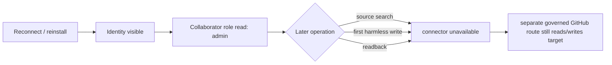

# OpenAI GitHub connector instability — sanitized longitudinal evidence

Status: `OBSERVED / REPRODUCIBLE ACROSS MULTIPLE SESSIONS / ROOT CAUSE UNKNOWN`

This note is a public, sanitized evidence packet for upstream reporting. It deliberately excludes tokens, GitHub App installation IDs, private repository names, private conversation text, and raw authenticated payloads.

## Summary

The observed failure is not one stable error class. Authenticated identity and repository collaborator role can be visible, while later connector operations become unavailable; these observations do not by themselves establish the connector token or GitHub App effective write authority.

## FACT

- Historical baseline: native connector reads worked while writes returned `403 Resource not accessible by integration`.
- After a full revoke/reinstall/reconnect with broad repository authorization, authenticated identity and the user's `admin` collaborator role were visible through the native connector. That role describes the account/repository relationship, not the connector token or GitHub App effective scopes.
- In the same working period, a first harmless write path, a source-search path, and later an independent readback caused the native connector to become unavailable/disabled rather than consistently returning the prior 403 class.
- A separately authenticated GitHub CLI route remained able to observe or mutate the same user-owned repository state during these native-connector failures.
- Reauthorization therefore changed visible identity/tool state but did not make the native connector stable.

## INFERENCE

The observations are consistent with connector/session or tool-registry state becoming invalid after successful initialization, but they do not rule out a static connector or GitHub App permission limitation. The separately authenticated CLI control demonstrates account/repository reachability through another credential path; it does not establish the native connector token's effective authority.

## UNKNOWN

- Effective scopes/permissions of the native connector token or GitHub App at the failing operations.
- GitHub App installation/cache propagation vs MCP/tool discovery/runtime invalidation.
- Whether a particular GitHub operation triggers the state loss or merely encounters it first.
- Whether connector state is scoped to a chat, branch/thread lineage, runtime worker, or account session.

## Impact

This makes the connector unsuitable as the sole GitHub path for engineering workflows that require `write -> independent readback`. A failed/disappeared readback cannot safely be interpreted as write failure, so every consequential workflow needs a second GitHub route and reconciliation logic.

## Related upstream reports

- `openai/codex#37330` — reconnect succeeds, repositories/write authority still fail.
- `openai/codex#39018` — selective read endpoints return 403.
- `openai/codex#40729` — connector loses tools after permission changes.

This packet adds longitudinal state-transition evidence: **identity/collaborator role visible -> later tool loss in the same authenticated working period**.

Machine-readable companion: `2026-09-04-openai-github-connector-instability.json`.
